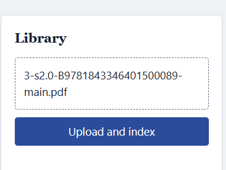
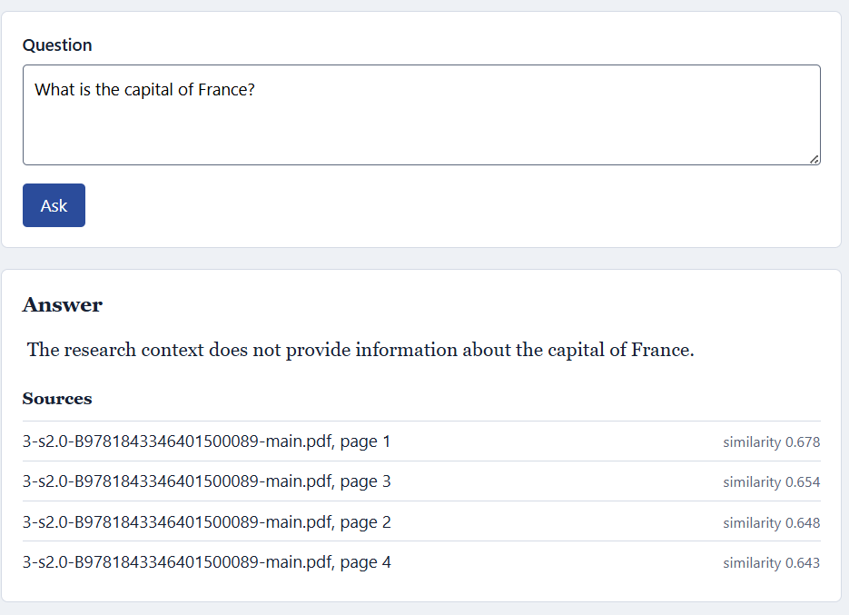
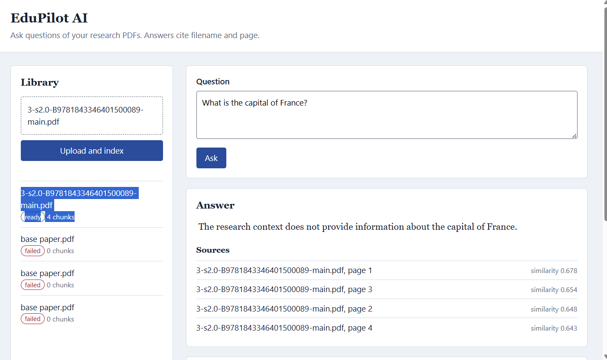

# 🎓 EduPilot AI

### AI-Powered Research Assistant for Grounded Document Question Answering

EduPilot AI is a **Retrieval-Augmented Generation (RAG)** application that allows users to upload research PDFs and ask natural-language questions about their content.

Instead of relying only on an LLM's general knowledge, EduPilot retrieves the most relevant document chunks using **semantic vector search** and provides them to a **Mistral LLM** as context. This helps produce answers grounded in the uploaded documents and allows the application to display the relevant sources.

---

## ✨ What Can EduPilot Do?

* 📄 Upload research PDFs
* 🔎 Extract and clean document text
* ✂️ Split documents into overlapping chunks
* 🧠 Generate semantic embeddings using Sentence Transformers
* ⚡ Retrieve relevant chunks using MongoDB Atlas Vector Search
* 🤖 Generate grounded answers using Mistral through Ollama
* 📚 Display source document and page information
* 📝 Store query and answer history
* 🚫 Avoid unnecessary LLM calls when relevant context is unavailable
* 🌐 Expose functionality through Flask REST APIs

---

## 🖥️ Application Preview

### 📄 Document Upload

Users can upload research PDFs and monitor their processing status.

---

### 🧠 RAG Pipeline

EduPilot follows a complete retrieval-augmented generation pipeline:

---

### 💬 Grounded Question Answering

The system retrieves relevant document sections and uses them as context for Mistral to generate an answer with source information.

---

# 🏗️ Architecture

```text
                         ┌──────────────────────┐
                         │       User           │
                         │  Upload PDF / Query  │
                         └──────────┬───────────┘
                                    │
                                    ▼
                         ┌──────────────────────┐
                         │     Flask REST API   │
                         └──────────┬───────────┘
                                    │
                  ┌─────────────────┴─────────────────┐
                  │                                   │
             Upload PDF                         Ask Question
                  │                                   │
                  ▼                                   ▼
        ┌─────────────────┐                 ┌─────────────────┐
        │  PyMuPDF        │                 │ Question        │
        │  Text Extraction│                 │ Embedding       │
        └────────┬────────┘                 └────────┬────────┘
                 │                                   │
                 ▼                                   ▼
        ┌─────────────────┐                 ┌─────────────────┐
        │ Text Cleaning   │                 │ MongoDB Atlas   │
        │ & Chunking      │                 │ Vector Search   │
        └────────┬────────┘                 └────────┬────────┘
                 │                                   │
                 ▼                                   ▼
        ┌─────────────────┐                 ┌─────────────────┐
        │ BGE Embeddings  │                 │ Relevant        │
        │ 384 dimensions  │                 │ Document Chunks │
        └────────┬────────┘                 └────────┬────────┘
                 │                                   │
                 ▼                                   │
        ┌─────────────────┐                          │
        │ MongoDB Atlas   │◄─────────────────────────┘
        │ Chunks + Vector │
        └────────┬────────┘
                 │
                 ▼
        ┌──────────────────────────┐
        │ Context + User Question  │
        └────────────┬─────────────┘
                     │
                     ▼
        ┌──────────────────────────┐
        │ Mistral via Ollama       │
        │ Local LLM                │
        └────────────┬─────────────┘
                     │
                     ▼
        ┌──────────────────────────┐
        │ Grounded Answer +        │
        │ Sources + Query History  │
        └──────────────────────────┘
```

---

# 🔄 How It Works

## 1. Document Upload

The user uploads a PDF through the web interface.

The Flask API receives the file and passes it to the document service.

---

## 2. Text Extraction

EduPilot uses **PyMuPDF** to extract text from the PDF while preserving page information.

The page number is retained so that retrieved chunks can later be shown with their source page.

---

## 3. Text Cleaning & Chunking

Extracted text is cleaned and divided into smaller overlapping chunks.

Current configuration:

| Parameter     |     Value |
| ------------- | --------: |
| Chunk size    | 450 words |
| Chunk overlap |  75 words |

The overlap helps preserve context when an important sentence falls near a chunk boundary.

---

## 4. Embedding Generation

Each chunk is converted into a semantic vector using:

```text
BAAI/bge-small-en-v1.5
```

The embeddings are normalized and stored along with the corresponding document metadata.

---

## 5. Vector Storage

EduPilot stores document metadata, chunks, embeddings, and query history in **MongoDB Atlas**.

The chunk embeddings are searched using **MongoDB Atlas Vector Search**.

The vector index uses:

```text
Index:       chunk_vector_index
Field:       embedding
Dimensions:  384
Similarity:  cosine
```

---

## 6. Semantic Retrieval

When a user asks a question, the same embedding model converts the question into a vector.

MongoDB Atlas Vector Search then retrieves the most semantically relevant chunks.

The current retrieval configuration uses:

```text
numCandidates = 50
limit = 5
```

The retrieved chunks contain information such as:

* document filename
* page number
* chunk text
* vector similarity score

---

## 7. Grounded Generation

The retrieved content is combined into a context prompt:

```text
Research Context
       +
User Question
       ↓
Mistral
       ↓
Grounded Answer
```

Mistral runs locally through **Ollama**, so the application does not require a hosted Mistral API key.

---

## 8. Source Attribution

Retrieved chunks retain their original document and page information.

The final response can therefore identify the source document and relevant page instead of returning an unsupported answer.

If the retrieved context does not contain enough information to answer a question, EduPilot responds that the information is not present in the provided research context rather than relying on unrelated general knowledge.

---

# 🧠 Why RAG?

A conventional LLM can answer questions using its pretrained knowledge, but that does not guarantee that the answer comes from the user's documents.

EduPilot uses RAG to introduce a retrieval step:

```text
User Question
      ↓
Question Embedding
      ↓
Vector Search
      ↓
Relevant Document Chunks
      ↓
Context
      ↓
Mistral
      ↓
Grounded Answer
```

This approach is useful for research documents because the system can retrieve relevant evidence before generating an answer.

---

# 🛠️ Technology Stack

| Layer           | Technology                     |
| --------------- | ------------------------------ |
| Language        | Python                         |
| Backend         | Flask                          |
| API             | REST                           |
| LLM             | Mistral                        |
| LLM Runtime     | Ollama                         |
| RAG             | Retrieval-Augmented Generation |
| Embeddings      | Sentence Transformers          |
| Embedding Model | `BAAI/bge-small-en-v1.5`       |
| Vector Database | MongoDB Atlas Vector Search    |
| Database        | MongoDB                        |
| PDF Processing  | PyMuPDF                        |
| Frontend        | HTML, CSS, JavaScript          |
| Testing         | pytest / unittest              |

---

# 📡 REST API

### Upload Document

```http
POST /api/documents
```

Uploads and processes a PDF document.

---

### Ask a Question

```http
POST /api/query
```

Example request:

```json
{
  "question": "What challenges do first-year college students face?"
}
```

The system retrieves relevant document chunks and generates a grounded response.

---

### Get Documents

```http
GET /api/documents
```

Returns uploaded documents and their processing status.

---

### Query History

```http
GET /api/queries
```

Returns previously submitted questions and generated answers.

---

# ⚙️ Local Setup

## 1. Clone the Repository

```bash
git clone https://github.com/kethan1906/EduPilot-AI.git
cd EduPilot-AI
```

---

## 2. Create a Virtual Environment

### Windows

```powershell
python -m venv .venv
.venv\Scripts\Activate.ps1
```

### Linux / macOS

```bash
python3 -m venv .venv
source .venv/bin/activate
```

---

## 3. Install Dependencies

```bash
pip install -r requirements.txt
```

For development/testing:

```bash
pip install -r requirements-dev.txt
```

---

# 🤖 Configure Ollama

Install Ollama and download the Mistral model:

```bash
ollama pull mistral
```

The application expects Ollama to run locally at:

```text
http://localhost:11434
```

Verify the model:

```bash
ollama list
```

The default configuration uses:

```env
OLLAMA_HOST=http://localhost:11434
OLLAMA_MODEL=mistral:latest
```

---

# 🍃 Configure MongoDB Atlas

Create a MongoDB Atlas cluster and obtain its connection string.

Create a `.env` file based on `.env.example`:

```env
MONGODB_URI=mongodb+srv://<user>:<password>@<cluster>.mongodb.net/?retryWrites=true&w=majority
MONGODB_DB=edupilot

OLLAMA_HOST=http://localhost:11434
OLLAMA_MODEL=mistral:latest

MAX_UPLOAD_MB=25
FLASK_DEBUG=0
```

### Vector Search Index

Create the Atlas Vector Search index:

```text
Index Name: chunk_vector_index
Path: embedding
Dimensions: 384
Similarity: cosine
```

---

# ▶️ Run the Application

Start the Flask application:

```bash
python app.py
```

Open:

```text
http://127.0.0.1:5000
```

---

# 🧪 Testing

EduPilot includes automated tests for the API, document processing, RAG service, and text utilities.

Run:

```bash
python -m pytest -v
```

The project was tested with the complete test suite before being published.

---

# 📁 Project Structure

```text
EduPilot-AI/
│
├── db/
│   ├── __init__.py
│   └── mongo.py
│
├── routes/
│   ├── __init__.py
│   └── api.py
│
├── services/
│   ├── __init__.py
│   ├── document_service.py
│   ├── embedding_service.py
│   └── rag_service.py
│
├── scripts/
│   └── create_vector_index.py
│
├── static/
│   ├── css/
│   │   └── style.css
│   └── js/
│       └── app.js
│
├── templates/
│   └── index.html
│
├── tests/
│   ├── fakes.py
│   ├── test_api.py
│   ├── test_document_service.py
│   ├── test_rag_service.py
│   └── test_text_utils.py
│
├── utils/
│   ├── pdf_utils.py
│   └── text_utils.py
│
├── screenshots/
│   ├── document-upload.png
│   ├── grounded-answer.png
│   └── RAG.png
│
├── app.py
├── config.py
├── exceptions.py
├── requirements.txt
├── requirements-dev.txt
├── .env.example
└── README.md
```

---

# 🔐 Security

Sensitive configuration is intentionally excluded from version control.

The repository ignores:

```text
.env
.venv/
__pycache__/
```

Never commit MongoDB credentials, API keys, passwords, or other secrets.

---

# ⚠️ Current Limitations

* PDF ingestion currently focuses on text extraction.
* Image-heavy or scanned PDFs may require OCR support.
* Local Mistral inference depends on the available system hardware.
* MongoDB Atlas Vector Search requires a configured Atlas cluster and vector index.
* Answer quality depends on document quality, chunking, retrieval, and LLM behavior.

---

# 🎯 Project Highlights

### Retrieval-Augmented Generation

Combines semantic retrieval with LLM generation to answer questions using uploaded research documents.

### Semantic Search

Uses Sentence Transformer embeddings and MongoDB Atlas Vector Search instead of simple keyword matching.

### Grounded Responses

Retrieved document chunks are supplied as context to Mistral, with document and page information retained for source attribution.

### Local LLM Inference

Mistral runs through Ollama locally, avoiding dependency on a hosted Mistral API.

### Modular Backend

The application separates API routes, document processing, embeddings, database operations, and RAG logic into dedicated modules.

### Automated Testing

The repository includes unit/API tests covering core application behavior.

---

# 👨‍💻 Author

**M. Srinikethan**

B.Tech — Data Science

GitHub: [@kethan1906](https://github.com/kethan1906)


---

⭐ If you find the project interesting, consider starring the repository.
